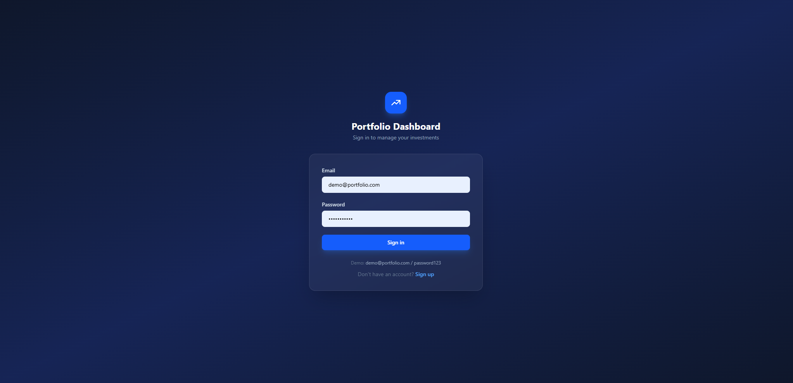
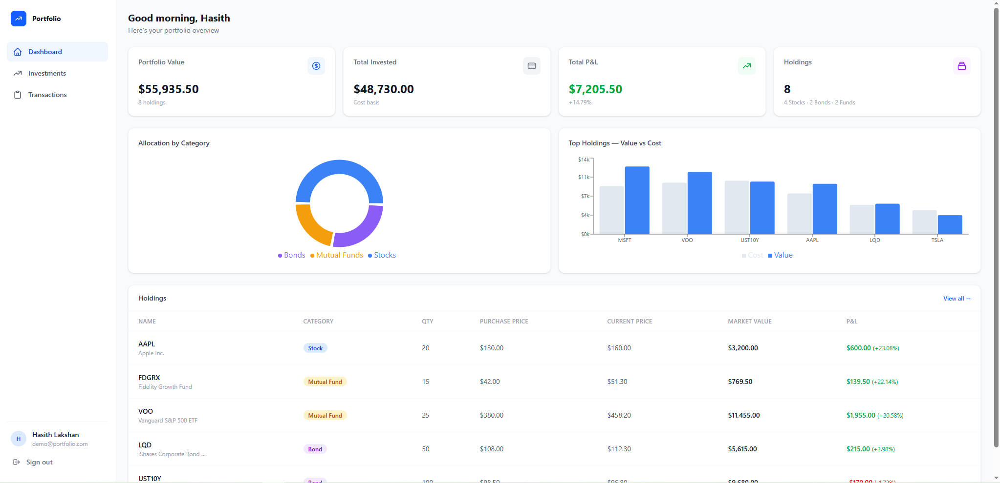
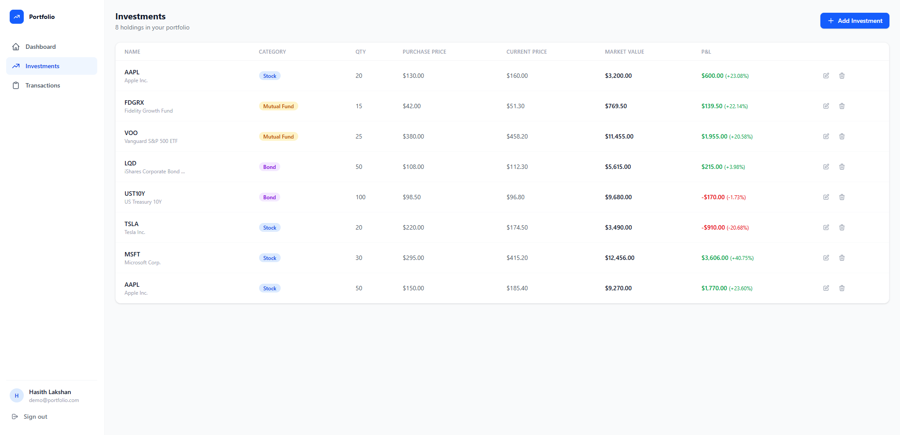
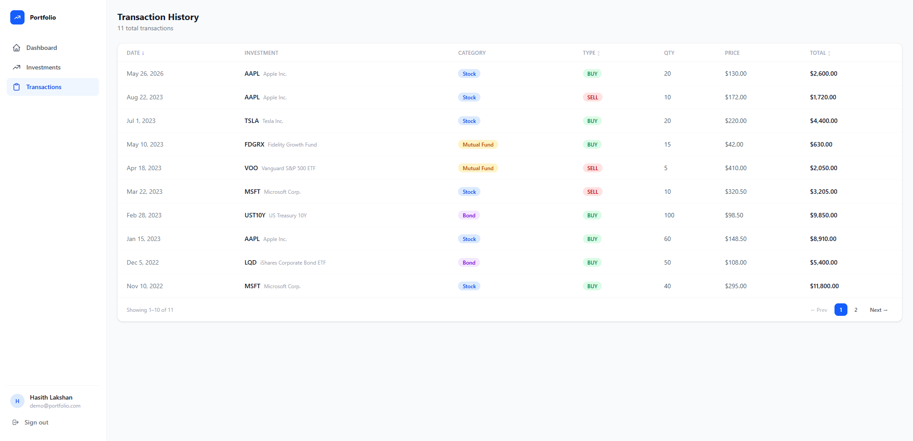

# Portfolio Management Dashboard

A full-stack portfolio management application built with React, Node.js, TypeScript, and PostgreSQL. Users can track investments across stocks, bonds, and mutual funds with real time P&L, transaction history, and interactive charts.

---

## Screenshots

**Login Page**


**Dashboard**


**Investments**


**Transactions**


---

## Architecture

```
portfolio-dashboard/
├── backend/          # Node.js + Express + TypeScript API
│   ├── src/
│   │   ├── config/       # Env validation (Zod), Prisma client singleton
│   │   ├── middleware/   # JWT auth, centralized error handler
│   │   ├── modules/      # Feature modules: auth, investments, transactions
│   │   │   └── {feature}/  route → controller → service → Prisma
│   │   └── utils/        # ApiError class, JWT helpers
│   └── prisma/
│       ├── schema.prisma # PostgreSQL schema (User, Investment, Transaction)
│       └── seed.ts       # Demo user + realistic portfolio data
│
└── frontend/         # React + Vite + TypeScript SPA
    └── src/
        ├── api/          # Axios client + per-feature API functions
        ├── app/          # Redux store (auth only), React Router config
        ├── components/   # Shared UI: Modal, Badge, EmptyState, Spinner
        ├── features/     # auth · dashboard · investments · transactions
        ├── hooks/        # useAuth (reads RTK auth state)
        ├── layouts/      # AppLayout (sidebar shell)
        └── types/        # Shared TypeScript interfaces
```

**Layering:**
- Backend: `Route → Controller (parse/validate) → Service (business logic) → Prisma (data access)`
- Frontend: `Page → useEffect + Axios → local state` · `RTK slice for auth/reg only`

---

## Tech Stack

| Layer | Technology |
|---|---|
| Frontend | React 18, Vite, TypeScript |
| State | Redux Toolkit (auth) + useState/useEffect (server data) |
| Styling | Tailwind CSS v4 |
| Forms | React Hook Form + Zod |
| Charts | Recharts |
| HTTP | Axios (shared instance with JWT interceptor) |
| Backend | Node.js, Express, TypeScript |
| ORM | Prisma |
| Database | PostgreSQL 16 |
| Auth | JWT (access token) + bcrypt |
| Infra | Docker Compose, nginx |

---

## Quick Start (Docker)

**Prerequisites:** Docker + Docker Compose installed.

```bash
git clone https://github.com/hasithlakshan/portfolio-dashboard.git
cd portfolio-dashboard
docker compose up --build
```

- Frontend: http://localhost:5173
- Backend API: http://localhost:3000
- Health check: http://localhost:3000/health

**Demo credentials:**
```
Email:    demo@portfolio.com
Password: password123
```

---

## Local Development

### Backend

```bash
cd backend
cp .env.example .env        # configure DATABASE_URL to your local Postgres
npm install
npx prisma migrate dev      # run migrations
npx prisma db seed          # seed demo data
npm run dev                 # starts on :3000
```

### Frontend

```bash
cd frontend
npm install
npm run dev                 # starts on :5173 (proxies /api → :3000)
```

---

## API Endpoints

### Auth
| Method | Path | Description | Auth |
|---|---|---|---|
| POST | `/api/auth/register` | Register new account, returns JWT + user | — |
| POST | `/api/auth/login` | Login, returns JWT + user | — |
| GET | `/api/auth/me` | Get current user | ✓ |

### Investments
| Method | Path | Description | Auth |
|---|---|---|---|
| GET | `/api/investments` | List all user investments | ✓ |
| GET | `/api/investments/:id` | Get single investment | ✓ |
| POST | `/api/investments` | Create investment (auto-creates BUY transaction) | ✓ |
| POST | `/api/investments/:id/sell` | Sell units of an investment (auto-creates SELL transaction) | ✓ |
| PUT | `/api/investments/:id` | Update investment | ✓ |
| DELETE | `/api/investments/:id` | Delete investment (cascades transactions) | ✓ |


### Transactions
| Method | Path | Description | Auth |
|---|---|---|---|
| GET | `/api/transactions` | Paginated + sortable history | ✓ |

**Query params for `/api/transactions`:**
- `page`, `limit` — pagination
- `sortBy` — `createdAt` \| `total` \| `type`
- `sortOrder` — `asc` \| `desc`
- `investmentId` — filter by investment

---

## Testing

### Backend — Jest + Supertest

```bash
cd backend
npm test
```

All backend tests mock Prisma — no real database required.

| Test file | What is tested |
|---|---|
| `src/modules/auth/auth.service.test.ts` | login success · wrong email · wrong password · getMe · getMe 404 |
| `src/modules/investments/investments.service.test.ts` | getAll · getById · getById 404 · create (atomic tx) · update · update 404 · delete · delete 404 · sell · sell with notes · sell exceeds holdings 400 · sell full position · sell 404 |
| `src/modules/transactions/transactions.service.test.ts` | pagination · totalPages · skip offset · investmentId filter |
| `src/tests/auth.routes.test.ts` | POST /login 200 · POST /login 401 · POST /login 400 · GET /me 401 (no token) · GET /me 401 (bad token) · GET /me 200 · GET /health |

**30 tests, 4 suites — all passing**

---

### Frontend — Vitest + React Testing Library

```bash
cd frontend
npm test
```

| Test file | What is tested |
|---|---|
| `src/components/DataTable.test.tsx` | renders headers and rows · loading spinner · empty state · sort click triggers callback · header slot renders |

**5 tests, 1 suite — all passing**

---

## Database Schema

```
User              Investment                 Transaction
────              ──────────                 ───────────
id (cuid)         id (cuid)                  id (cuid)
email (unique)    userId → User              userId → User
password (bcrypt) name, ticker               investmentId → Investment
name              category (STOCK|BOND|MF)   type (BUY|SELL)
createdAt         quantity (Decimal 18,8)    quantity, price, total
                  purchasePrice (Decimal)    notes?
                  currentPrice  (Decimal)    createdAt
                  purchasedAt, timestamps
```

`Decimal(18,2)` used for prices — avoids float precision issues common in financial data.
